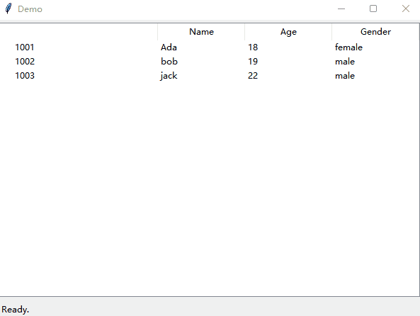

# tkinter-examples

Jackie Wang's Tkinter Examples

File|Note
-|-
[mainwindow.py](./mainwindow.py)| Mainwindow class.  Mainwindow contain a empty menubar, toolbar, statusbar and mainframe.
[dialog.py](./dialog.py)| Modal dialog class.
[tree_edit_demo.py](./tree_edit_demo.py) | A demo script for editable treewiew.

